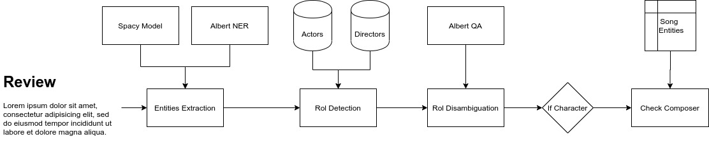

# NERTest
Code for the *NER* test. Prepare data and extract entities from movie reviews and queries.

You can [try the demo web app](http://mmartgal.ddns.net:5000) with your own queries and reviews!

### Data Insights

The data is a collection of queries about movies. The problem consists on recgnize different entities in the queries, and comes labelled in the BIO format.

The entities to be recongnized are the next ones:
- `REVIEW`
- `AWARD`
- `DIRECTOR`
- `RATING`
- `RATINGS_AVERAGE`
- `GENRE`
- `CHARACTER`
- `QUOTE`
- `ORIGIN`
- `SONG`
- `ACTOR`
- `TITLE`
- `PLOT`
- `RELATIONSHIP`
- `YEAR`
- `TRAILER` 

There are some of them that are just some words (e.g. the `TRAILER`), but other are really complex such as `PLOT`, `QUOTE` or `REVIEWS`. This are some examples of `PLOT`:
- Sample 1
> did	O
> 
> dame	B-ACTOR
> 
> judy	I-ACTOR
> 
> dench	I-ACTOR
> 
> star	O
> 
> in	O
> 
> a	O
> 
> british	B-PLOT
> 
> film	O
> 
> about	O
> 
> queen	B-CHARACTER
> 
> elizabeth	I-CHARACTER
> 
- Sample 2
> show	O
> 
> me	O
> 
> a	O
> 
> movie	O
> 
> about	O
> 
> cars	B-PLOT
> 
> that	I-PLOT
> 
> talk	I-PLOT
As it can be seen it is really difficult to find a patter to recognize this entity. Thus, some labels are not going to be recognized to focus the effort in the other ones that are more interesting, like `ACTOR` or `TITLE`. The list of labels to be recognized is the next one:
- `AWARD`
- `DIRECTOR`
- `RATING`
- `RATINGS_AVERAGE`
- `GENRE`
- `CHARACTER`
- `SONG`
- `ACTOR`
- `TITLE`
- `YEAR`
- `TRAILER` 

##### Errors and mismatches

The data contains also some errors and mismatches. For instance take a look into the next sample, in which *harry potter* appears labelles as `TITLE`, but in fact it is a `CHARACTER`. Or in the same sample, the word soundtrack that it is mispelled.
> can	O
> 
> you	O
> 
> get	O
> 
> a	O
> 
> soundtrac	B-SONG
> 
> for	O
> 
> the	O
> 
> harry	B-TITLE
> 
> potter	I-TITLE
> 
> films	I-TITLE

Or in this samples, in which the word *directed* appears labelled as `DIRECTOR` when it is not.
> who	O
> 
> directed	B-DIRECTOR
> 
> the	O
> 
> film	O
> 
> pulp	B-TITLE
> 
> fiction	I-TITLE
> 
> that	O
> 
> starred	O
> 
> john	B-ACTOR
> 
> travolta	I-ACTOR

### The Approach

The first approach was to train an *Albert* model and a *Spacy* model to extract the entities with both files. This didn't work because the queries are really complex, the entities to extract are ambiguous and in some cases are wrong. This results in models that fail always.

After seeing that to train a *NER* model to solve the problem wasn't enough, a more traditional process was tested, this is, the use of knowledge resources and regular expressions to find the entities. This is not as powerful as Deep Learning, but when the data is complex and there are not enough samples to train, used to work better than Deep Learning.

In this case there are different technologies working together to extract entities. For instance let's go deeper into the way actors, directors and characters are recognized:

The first thing is to run the *Spacy NER* pretrained model and the *Albert NER* model to extract the entities. Then, the person entities are analyzed to check if it corresponds to an actor, to a director or to a character. In order to do this, the entity is searched into the actors and directors list. In case it only appears in one of the list, that label is assigned. In case it does not appear in any of the lists, the `CHARACTER` label is assigned. The problem appears when the person is both a director and an actor. To solve this two approaches are used. A question is made to a *Question Answering* model, asking if the person appears in the text as an actor. If there is any result, it is finally checked with a regular expression to assure that it is not a director. In case the *QA* model does not answer anything a second question is made, asking if the persons appears as a director in the text. Once again, a regular expression is used to check the result. 

This way all the person labels detected are assigned to one of: actor, director or character. But there are sometimes that it is the name of a composer or singer, so if a `CHARACTER` label appears next to a `SONG` label it is deleted from the characters list.

If for some reason there is an actor or director in the text that has not been recognized with this method there is still another chance for it. the code tries to match the movie the text speaks about with a database of movies. If it is matched, the title, the genres, the actors and the directors are searched in the text.

Even when it is a powerful and robust method, it has some disadvantages: 
- Slow method: In the worst case, it is needed to run a *Spacy* model, an *Albert* model for *NER* and 2 *Albert* models for *QA*.
- *NER* problems: In case the name is not recognized by any of the models it will be not recognized. This may be due to case problems. (This models are trained with names in uppercase, so names in lowercase tends to not be recognized. To solve this some libraries try to correct the case, but they are too slows. Another option is to train the models with names in lowercase.
- Spell errors: If the name has any spell error it is not going to be matched in this approach. To solve this is not too complex, for example a fuzzy search could be done with, for instance, the Levenshtein distance in order to match the names.

### Project Structure 

The assets folder contains files used to extract entities, such as list of [actors](assets/actors.list) or [directors](directors.list).

The data folder contains the data, raw and processed. See the [preprocessing notebook](notebooks/data_preprocessing.ipynb) to process the original data.

The src folder contains the source code. The file [src/detector.py](src/detector.py) is the one that contains all the extraction code.

The notebooks folder contains *Jupyter* notebooks to explore the data, extract the entities and [get the metrics](notebooks/metrics.ipynb).

The entities of both files ([engtrain.bio](engtrain.bio) and [trivia10k13train.bio](trivia10k13train.bio)) have been unified to make the code generic for both files. Take a look into the [preprocessing notebook](notebooks/data_preprocessing.ipynb) to see the process.

### Metrics

The metrics (weighted) with all labels are the next ones:

##### engtest.bio
- Precission: 0.72
- Recall: 0.72
- F1-Score: 0.68

Confussion Matrix:

##### trivia10k13test.bio
- Precission: 
- Recall:
- F1-Score:

Confussion Matrix:

On the other hand, the metrics (weighted) with just the labels that are being recognized are the next ones:

##### engtest.bio
- Precission: 0.79
- Recall: 0.76
- F1-Score: 0.74

Confussion Matrix:

##### trivia10k13test.bio
- Precission: 
- Recall: 
- F1-Score: 

Confussion Matrix:

